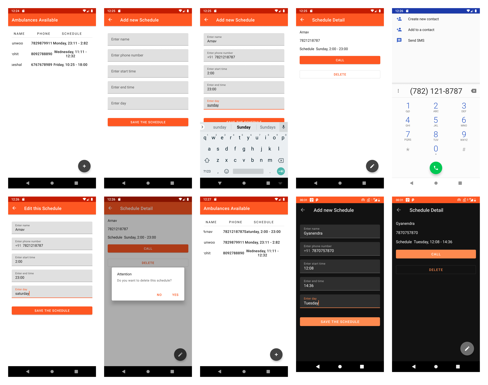

# Android-Study-Jams

Ambulance Schedule

**Problem Statement**

In our university, the ambulance services are provided by multiple drivers, who have different timings. It can be difficult to keep track of the ambulance service schedules. When it is time to call the ambulance service, we need to know the next available driver. By storing the information of the drivers in a database, we can easily find the current available driver.

**Proposed Solution**

We propose an app that can be used to store the information of the drivers. The app can be used to add new drivers, to find the current available driver, and to delete the drivers. It can also update the information of the drivers. More importantly, it can be used to dial the numbers from the app itself.

**Functionality & Concepts used :**

1. viewBinding, constraint layouts, recycler views

2. Fragments and Navigation Library

2. ViewModel : View Model allows us to create a single instance of the ViewModel class and share it among all the activities in the application. It also helps us separate the application logic from the UI logic.

3. LiveData & Room Database : We are also using LiveData to update & observe any changes in the Bus driver's locations received from their mobile at real time and update it to local databases using Room. Coordinates are then updated in the bus route screen and students can track their route bus locations.

**Application Link & Future Scope :**

You can access the project repository at: https://github.com/srirajshukla/Ambulance_Schedule and the apk at : https://github.com/srirajshukla/Ambulance_Schedule/releases/download/v0.1.0/AmbulanceSchedule.apk

<u>Future Scopes:</u>

1. Add a current ambulance to the home page
2. Directly call when call button is pressed and fallback to dial screen is permission not granted, or some error occurs.
3. Fetch data from the server if available instead of depending on manual input.

Extend the application to multiple universities where the ambulance schedule can be different. The app can also be genralized to any other emergency service.